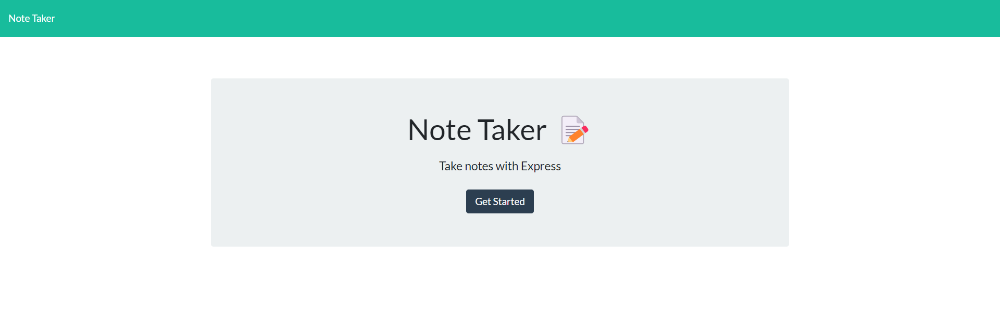
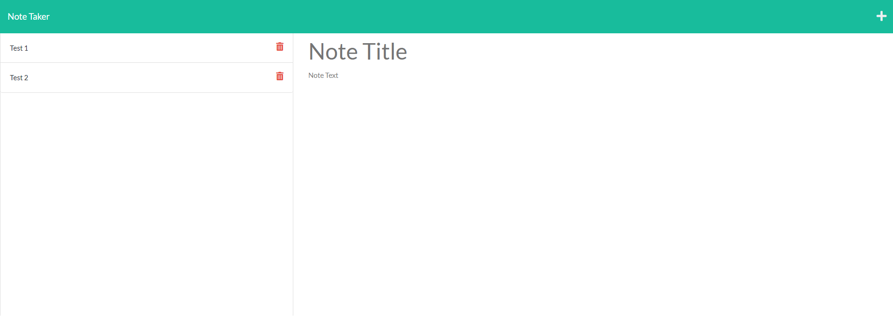

# Note Taker

## Description

A application that can be used to write and save notes. This app utilizes Express.js back end and when user saves the note, it is saved to JSON file also when user wants to retrieve files, then it will get data from JSON file. 

## Screenshot

The first page when user comes in.

User can add notes from this page.

## Tech Used

## Link
<a href="https://connorcho66.github.io/work-day-scheduler/">Link to depoloyed website</a>

## License

N/A

## Contact

<ul>
    <li><b>Email: </b> <a href="connorcho22@gmail.com">connorcho22@gmail.com</a></li>
    <li><b>Github: </b> <a href="https://github.com/connorcho66">connorcho66</a></li>
    <li><b>Linked In: </b> <a href="www.linkedin.com/in/seongyun-cho-89a8a61a0">SeongYun Cho</a></li>
</ul>